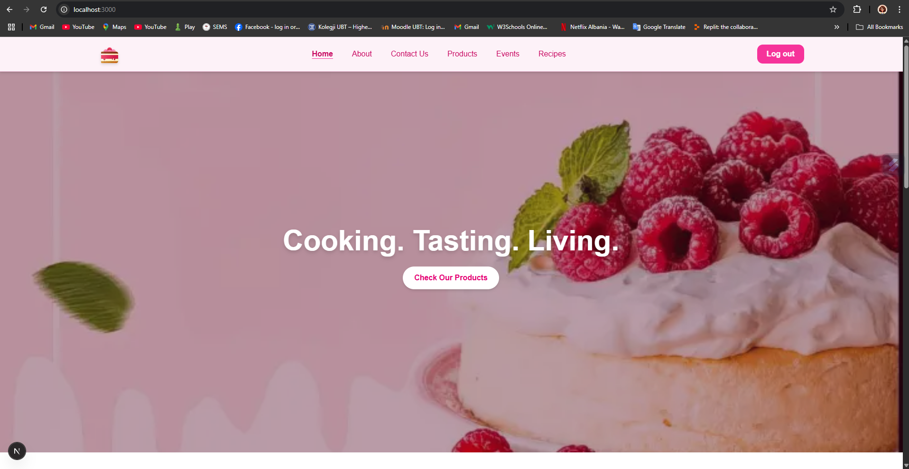

🍽️ FOODLY
✨ Savor Every Moment with Culinary Creativity Unleashed

🛠️ Built with the tools and technologies:
SCSS   Markdown   npm   JavaScript   MongoDB   React   TypeScript   ESLint

📚 Table of Contents
🔍 Overview
🚀 Getting Started
🧰 Prerequisites
🔧 Installation
▶️ Usage
🧪 Testing
-------------------------------------------------------------------------------------------------
🔍 Overview
Foodly is a powerful web application designed for food-related services, leveraging modern technologies to enhance user experience.

**🧑‍🍳 Why Foodly?**

This project aims to simplify the development of engaging culinary applications. The core features include:

- 🎨 **Tailwind CSS Integration** – Streamlines styling with utility-first CSS, enhancing UI/UX.
- ⚡ **Next.js Framework** – Supports server-side rendering and dynamic routing for fast, responsive apps.
- 🔐 **User Authentication** – Secure sign-in options with role-based access control.
- 🍲 **Dynamic Content Management** – Easy CRUD for products and recipes to boost engagement.
- 🔤 **TypeScript Support** – Type safety and better structure to avoid runtime bugs.
- 🔌 **API Integration** – Seamless backend communication for efficient data handling.
------------------------------------------------------------------------------------------------
🚀 Getting Started
🧰 Prerequisites
Make sure you have the following:

💻 Programming Language: TypeScript
📦 Package Manager: NPM

🔧 Installation
Follow these steps:

1. Clone the repository:
  > git clone https://github.com/emorina1/foodly
2. Navigate to the project directory:
  > cd foodly
3. Install the dependencies using npm:
  > npm install

▶️ Usage
To run the project:
>npm start

🧪 Testing
To run the test suite:
>npm test 

Linku i applikacionit:
http://localhost:3000/

Screenshots

Dea Mani (Full Stack Developer, Project Manager, Database Administrator (DBA))
Elsa Morina (Full Stack Developer, Project Manager)
Adi Berisha (Backend Developer)

